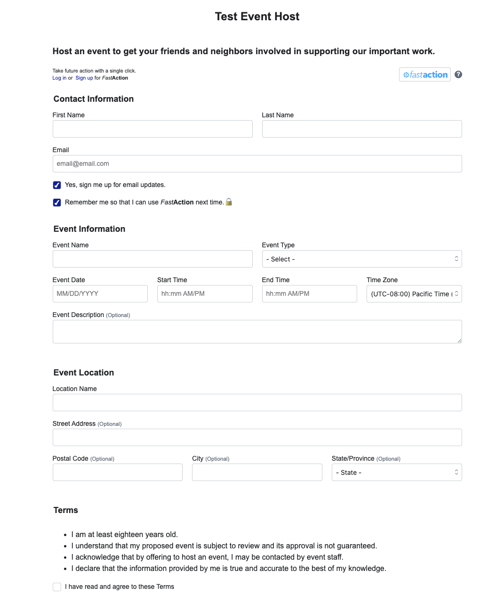

# Online Action Forms

## Overview
There are a variety of forms to work with under the Engagement > Online Actions. there are forms of a few different varieties here is what they appear to be from my testing

## Volunteer Forms
- These appear to be contact forms primarily that are used to gather the contact information of someone who is interested in volunteering with us
- These appear to also be used sometimes to do a survey (i dont think this is ideal to be honest as we dont always need contact information when we want a survey response)
- Example Use Case: We are looking for volunteers and we need a way for users to reach out to us if they are interested. Embedding a volunteer form on our site might be helpful.

## Advocacy Forms
- Prebuilt forms we can offer users that are auto filled with verbiage advocating for or against something. A candidate, a piece of legilation, whatever. These forms should be used when we want to make it easy for users to contact representatives regarding specific issues. 
- Example Use Case: Politician A proposes something we want to support, we can create a form for users to fill out with their contact information that will auto submit an email to Politician B expressing the users advocacy through our pre-defined message.

## Contribution Forms
- This is a form we can create for users to submit donations through. To use one of these we need to designate a "gateway account". I dont know about this but im sure its another config in the admin panel where we can link a bank account to reference.

## Petition Forms
- Pretty self evident tbh, we can make a form that outlines a given petition and the user can show their support by submitting their contact info. 
- This does also allow for additional questions beyond the petition statement

## Signup Form
- Functionally i cannot tell a difference between this and a Volunteer form

## Event Host Form
- This is a form that we can send out when we are hosting an event and we want to send invitations to people in our contact lists.
- We can request their contact info in the form contents
- Show the event location in the form
- also show conditions that the user must accept before form submission (age requirements, and non promissory guarantees)

### Example Form

## Story Collection Form
- This is a form that allows us to collection stories or testimonial style responses from users.
- Displays a form for the users contact information and a place for them to share a response
- Optional waiver for liability is a feature

## Optimized Collection
- TBD but probably similar to the contribution form with more configurability